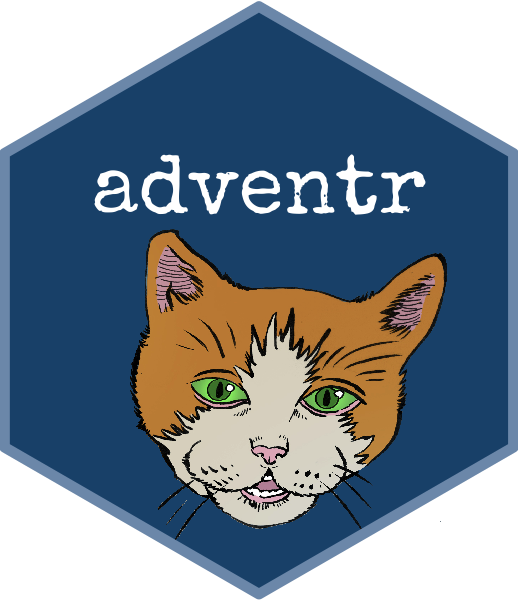

---
# Page title
title: adventr

# Title for the menu link if you wish to use a shorter link title, otherwise remove this option.
linktitle: adventr

# Page summary for search engines.
summary: Description of the adventr package for R

# Date page published
date: 2022-02-07

# Book page type (do not modify).
type: book

# Position of this page in the menu. Remove this option to sort alphabetically.
weight: 1

---

The `adventr` package contains a series of interactive tutorials that teach  alongside chapters of this textbook. The tutorials are written using a package called [learnr](https://rstudio.github.io/learnr/). Once a tutorial is running it's a bit like reading a book but with places where you can practice the R code that you have just been taught. The `adventr` package is free (as are all things -related) and offered to support tutors and students using my textbook who want to learn .

* [`adventr` on CRAN](https://cran.r-project.org/web/packages/adventr/index.html)
* [`adventr` GitHub page](https://github.com/profandyfield/adventr)

